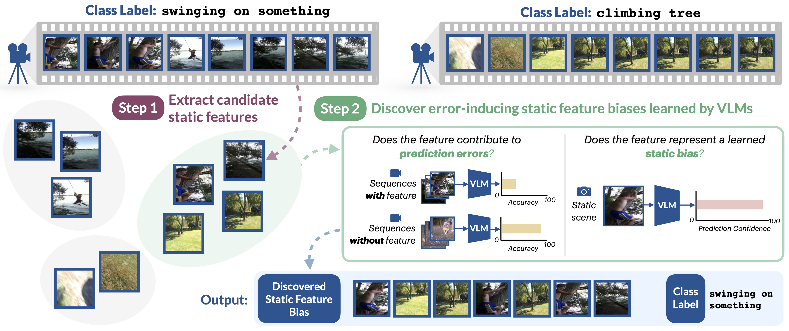

# TRoVe: Discovering Error-Inducing Static Feature Biases in Temporal Vision-Language Models 
[](LICENSE)

This repository contains the official PyTorch implementation for TRoVe: Discovering Error-Inducing Static Feature Biases in Temporal Vision-Language Models (NeurIPS 2025).



##  What is TRoVe?

When making predictions on temporal understanding tasks, vision-language models (VLMs) often rely on *static feature biases*, such as background or object features, rather than dynamic visual changes. Static feature biases are a type of shortcut and can contribute to systematic prediction errors. We introduce **TRoVe**, which can analyze a temporal VLM and discover learned static feature biases that induce errors at test time.

## 📎 Citation
If you find this repository useful for your work, please cite the following paper:

```
@inproceedings{
varma2025trove,
title={{TR}oVe: Discovering Error-Inducing Static Feature Biases in Temporal Vision-Language Models},
author={Maya Varma and Jean-Benoit Delbrouck and Sophie Ostmeier and Akshay S Chaudhari and Curtis Langlotz},
booktitle={The Thirty-ninth Annual Conference on Neural Information Processing Systems},
year={2025},
url={https://openreview.net/forum?id=KOwhczyFpg}
}
```

